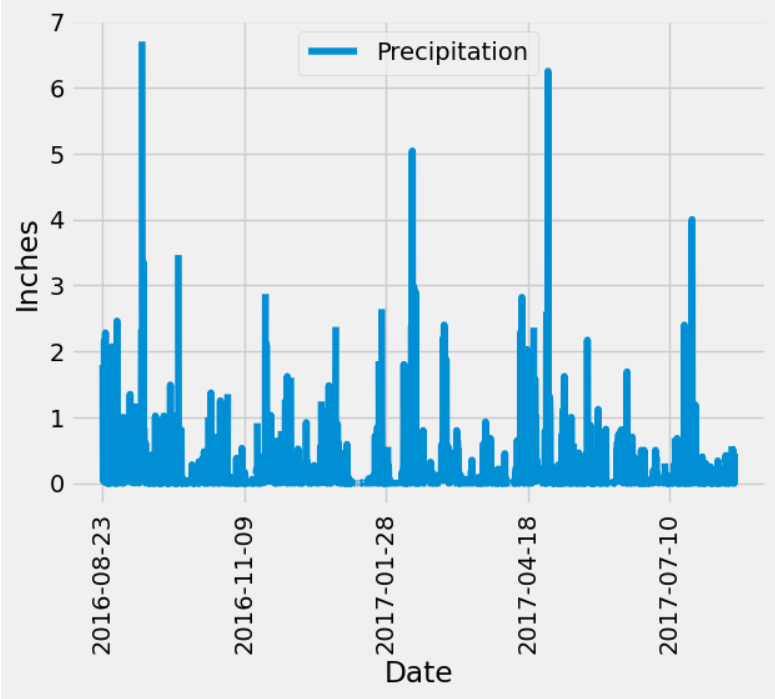
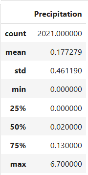
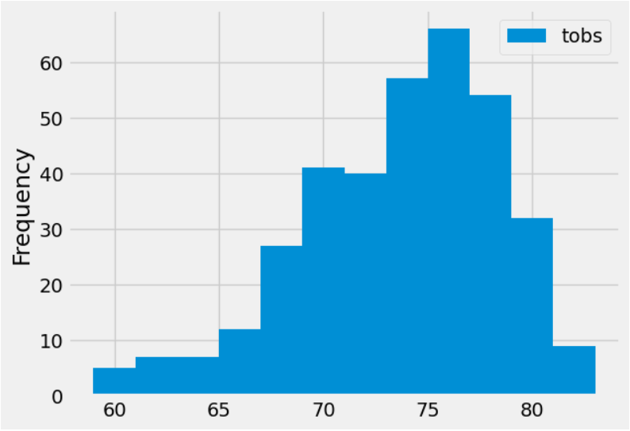
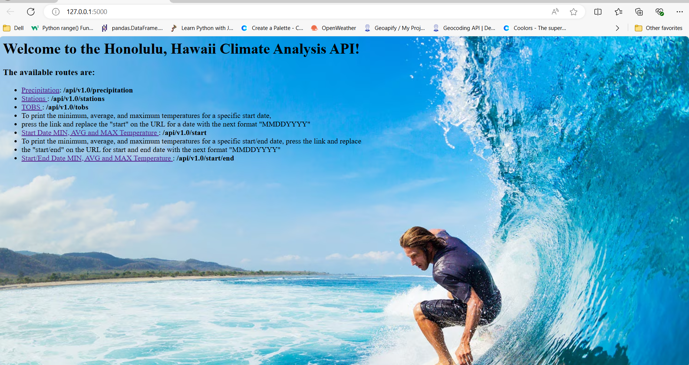

# ds_module_10_SQLAlchemy
Homework Module 10 - SQLAlchemy ORM
======== 
Objective
----
This project was done with the intention of designing queries from a SQLite file with tables that contain data from CSV files, that were imported into a Jupyter Notebook and Virtual Studio Code, to perform data analysis and data exploration, based on the following description:

Congratulations! You've decided to treat yourself to a long holiday vacation in Honolulu, Hawaii. To help with your trip planning, you decide to do a climate analysis about the area. Following sections outline the steps needs to take to accomplish this task.

Using the provided files "climate_starter.ipynb and hawaii.sqlite" complete the climate analysis and data exploration.

Part 1
===
Precipitation Analysis
---
Using Python and SQLAlchemy to do a basic climate analysis and data exploration of your climate database. Specifically, use SQLAlchemy ORM queries, Pandas, and Matplotlib. Complete the following steps:  
1. Find the most recent date in the dataset.
2. Using that date, get the previous 12 months of precipitation data by querying the previous 12 months of data.
3. Select only the "date" and "prcp" values.
4. Load the query results into a Pandas DataFrame. Explicitly set the column names.
5. Sort the DataFrame values by "date".
6. Plot the results by using the DataFrame plot method:

7. Use Pandas to print the summary statistics for the precipitation data:

Station Analysis
---
1. Design a query to calculate the total number of stations in the dataset.
2. Design a query to find the most-active stations (that is, the stations that have the most rows) and list the stations on descending order.
3. Design a query that calculates the lowest, highest, and average temperatures that filters on the most-active station id found in the previous query.
4. Design a query to get the previous 12 months of temperature observation (TOBS) data, for the station with greatest number of observations (check the previous step), then plot the results as a histagram:

Part 2
===
Design Your Climate App
--
Design a Flask API based on the queries previous developed. Use Flask to create the routes as follows:

1. /
    - Start at the homepage.
    - List all the available routes.

2. /api/v1.0/precipitation
    - Convert the query results from the precipitation analysis for 12 months to a dictionary using date as the key and prcp as the value.
    - Return the JSON representation of your dictionary.

3. /api/v1.0/stations
    - Return a JSON list of stations from the dataset.

4. /api/v1.0/tobs
    - Query the dates and temperature observations of the most-active station for the previous year of data.
    - Return a JSON list of temperature observations for the previous year.

5. /api/v1.0/<start> and /api/v1.0/<start>/<end>
    - Return a JSON list of the minimum temperature, the average temperature, and the maximum temperature for a specified start or start-end range.
    - For a specified start, calculate TMIN, TAVG, and TMAX for all the dates greater than or equal to the start date.
    - For a specified start date and end date, calculate TMIN, TAVG, and TMAX for the dates from the start date to the end date, inclusive.

